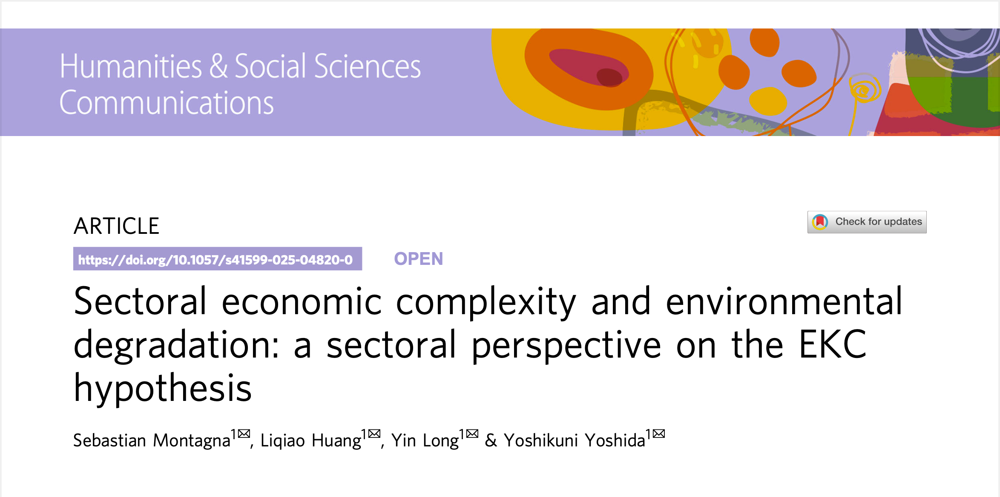

# Sectoral economic complexity and environmental degradation: a sectoral perspective on the EKC hypothesis



[Published Article in Humanities and Social Sciences Communications](https://www.nature.com/articles/s41599-025-04820-0)

## Abstract

As rising CO<sub>2</sub> emissions drive global environmental concerns, addressing climate change and ensuring sustainable development requires a nuanced understanding of the relationship between economic development and environmental degradation. This study introduces the Sectoral Complexity Index (SCI) to measure and analyze the sophistication of individual economic sectors and examines their influence on CO<sub>2</sub> emissions across 127 countries from 1995 to 2020. By refining the Environmental Kuznets Curve (EKC) hypothesis through a sectoral lens, the research uses a cross-sectional quantile regression to capture sector-specific environmental dynamics at varying stages of economic development. The results reveal heterogeneous patterns across sectors and income groups. Key industries, such as Iron & Steel, Machinery, Metal Products, and Mining & Quarrying show reduced CO<sub>2</sub> emissions with increased sophistication. Notably, the Iron & Steel and Machinery sectors exhibit a strong transition to lower emissions at the upper-middle-income level, while such transitions in the Metal Products and Mining & Quarrying sectors occurs at the high-income level. These results underscore the sectoral and income-specific dynamics of the environment-economy relationship, highlighting the importance of targeted policies that promote technological innovation and green energy transition in energy-intensive sectors. By offering deeper insights into the interplay between economic development and environmental sustainability, this research contributes to the discourse on the environment-economy relationship and informs policy strategies aimed at fostering sustainable economic development.

#### Authors

Sebastian Montagna, Liqiao Huang, Yin Long, and Yoshikuni Yoshida

Graduate School of Engineering, University of Tokyo, Tokyo, Japan

June, 2025

> **[ON THE WORKS] All data, code, and materials of the data processing, figures creation, and paper writing will be made publicly available upon publication.**

## Workflow

### [0. Exports Data](research/v0/notebooks/0.%20Exports%20Data.ipynb)
- Connects to raw and processed SQL databases.
- Loads raw trade data for all years, standardizes data types, and stores it in a unified table.
- Cleans country names, removes obsolete or merged countries, and maps to standardized short and ISO3 codes.
- Filters out countries with less than 1 million inhabitants (as of 2020) and those with less than $1B in exports per year.
- Aggregates and saves the cleaned export data for further use.

### [1. Indicators Data](research/v0/notebooks/1.%20Indicators%20Data.ipynb)
- Loads and harmonizes multiple sources of country-level indicators: OEC, OECD, World Bank, Ecological Footprint, and others.
- Standardizes country names and indicator formats.
- Pivots and merges indicator tables, ensuring all are indexed by year and country.
- Processes income group classifications and other metadata.
- Stores all processed indicators in the database for integration.

### [2. Complexity Indexes](research/v0/notebooks/2.%20Complexity%20Indexes.ipynb)
- Loads cleaned export data and HS code mappings.
- Maps products to sectors using a sector bridge table.
- Handles duplicate product codes and ensures sector assignments are unique.
- Calculates and validates total exports, ensuring data consistency.
- Drops unnecessary ID columns and prepares the data for complexity calculations.
- Stores the processed data for use in complexity index construction.

### [3. Custom Complexity Indexes](research/v0/notebooks/3.%20Custom%20Complexity%20Indexes.ipynb)
- Loads the main complexity data.
- Computes custom complexity metrics:
  - Positive PCI (ensures all PCI values are non-negative).
  - Product of PCI and RCA, and other interaction terms.
  - Sector and country diversity metrics (sum of RCA by group).
  - "Not sector diversity" (sum of 1-RCA).
- Calculates the Sectoral Complexity Index (SCI) as the sum of PCI*RCA by sector/country/year.
- Standardizes SCI within each sector for comparability.
- Handles missing or invalid data points.

### [4. Indicators Integration](research/v0/notebooks/4.%20Indicators%20Integration.ipynb)
- Loads all processed indicators and complexity indexes.
- Merges all data sources into a single DataFrame, aligning on year, country, and sector.
- Handles duplicate columns and missing values.
- Adds continent and current income group classifications.
- Structures the data for both country-level and sector-level analysis.
- Prepares the final integrated dataset for statistical modeling.

### [5. Custom Indicators](research/v0/notebooks/5.%20Custom%20Indicators.ipynb)
- Loads the integrated indicators dataset.
- Identifies all percentage-based indicators and normalizes them to a 0–1 scale.
- Creates new indicators by combining or transforming existing ones (e.g., total patents, patents per capita, environmental patents per capita).
- Ensures all custom indicators are merged back into the main dataset and sorted for consistency.

### [6. Rename Indicators](research/v0/notebooks/6.%20Rename%20Indicators.ipynb)
- Loads the final integrated dataset.
- Defines mappings to standardize and abbreviate sector and indicator names.
- Applies regex-based renaming to all complexity and indicator columns.
- Handles unmapped columns with generic names.
- Saves the mapping for use in regression and reporting scripts.
- Updates the dataset with the new, standardized column names.

### [7. Statistical Testing](research/v0/notebooks/7.%20Statistical%20Testing.ipynb)
- Loads the final dataset and applies the standardized variable names.
- Defines regression variables and control variables for analysis.
- Splits the data by income group and removes missing values.
- Computes descriptive statistics (mean, std, min, max, median, kurtosis, skewness) for each group.
- Performs normality tests (Shapiro-Wilk, Anderson-Darling) on all variables, by group.
- Stores and exports the results for further review.

### [8. Single Regression](research/v0/notebooks/8.%20Single%20Regression.ipynb)
- Loads the final, cleaned, and standardized dataset.
- Defines dependent, independent, and control variables for regression.
- Applies log transformations where appropriate.
- Prepares regression data, ensuring no missing values.
- Runs quantile regressions (and OLS) of CO2 emissions on sectoral complexity and controls, stratified by income group.
- Stores regression results, coefficients, and residuals for each group.
- Exports results to Excel and generates summary tables for reporting.

***

## Cite this Article

```bibtex
@article{Montagna2025,
title = {Sectoral economic complexity and environmental degradation: a sectoral perspective on the EKC hypothesis},
abstract = {As rising CO2 emissions drive global environmental concerns, addressing climate change and ensuring sustainable development requires a nuanced understanding of the relationship between economic development and environmental degradation. This study introduces the sectoral complexity index (SCI) to measure and analyze the sophistication of individual economic sectors and examines their influence on CO2 emissions across 127 countries from 1995 to 2020. By refining the environmental Kuznets curve (EKC) hypothesis through a sectoral lens, the research uses a cross-sectional quantile regression to capture sector-specific environmental dynamics at varying stages of economic development. The results reveal heterogeneous patterns across sectors and income groups. Key industries, such as Iron \& Steel, Machinery, Metal Products, and Mining \& Quarrying show reduced CO2 emissions with increased sophistication. Notably, the Iron \& Steel and Machinery sectors exhibit a strong transition to lower emissions at the upper-middle-income level, while such transitions in the Metal Products and Mining \& Quarrying sectors occurs at the high-income level. These results underscore the sectoral and income-specific dynamics of the environment-economy relationship, highlighting the importance of targeted policies that promote technological innovation and green energy transition in energy-intensive sectors. By offering deeper insights into the interplay between economic development and environmental sustainability, this research contributes to the discourse on the environment--economy relationship and informs policy strategies aimed at fostering sustainable economic development.},
author = {Montagna, Sebastian and Huang, Liqiao and Long, Yin and Yoshida, Yoshikuni},
date = {2025/06/05},
date-added = {2025-06-25 10:56:26 -0400},
date-modified = {2025-06-25 10:56:26 -0400},
doi = {10.1057/s41599-025-04820-0},
id = {Montagna2025},
isbn = {2662-9992},
journal = {Humanities and Social Sciences Communications},
number = {1},
pages = {764},
url = {https://doi.org/10.1057/s41599-025-04820-0},
volume = {12},
year = {2025},
bdsk-url-1 = {https://doi.org/10.1057/s41599-025-04820-0}}
```

***